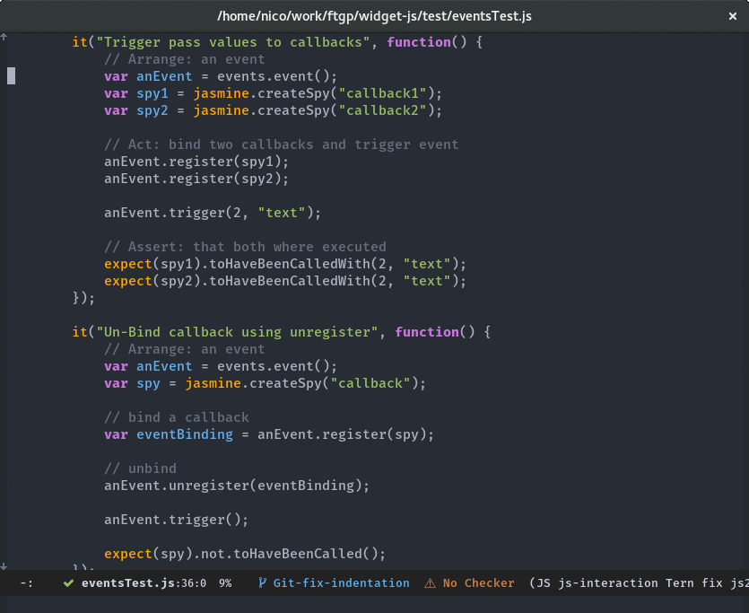
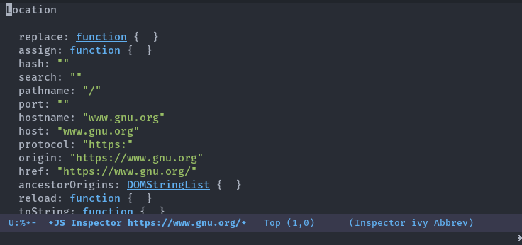

# Jade  

_**J**avaScript **A**wesome **D**evelopment **E**nvironment (in Emacs)_

Jade connects to a browser tab or nodejs process and provides many features for
JavaScript development, including:

- a REPL (with auto completion) & object inspection;
- an inspector, with history and navigation;
- a scratch buffer (`M-x jade-scratch`);
- JavaScript evaluation in JS buffers with `jade-interaction-mode`;
- a stepping Debugger, similar to `edebug`, or `cider`.

*Installation instruction and other documentation on readthedocs [here](https://jade.readthedocs.io).*

## Screenshots

The REPL with company-mode

The REPL showing clickable output

The inspector

The stepping debugger, and an inspector on locals

## Missing features

Jade is young, here's a list of missing/wanted features

- ~~Code evaluation using `C-x C-e` from project JS buffers~~
- ~~Adding breakpoints (to remove the need for `debugger` statements)~~
- Network inspector (could get inspiration from restclient.el)
- DOM inspector
- Start processes (~~chromium~~, node, grunt, gulp, etc.) from Emacs and attach a
  jade connection to it.

## Backends

There is currently support for Chrom[e|ium], & nodejs.  The firefox backend is
currently missing.

