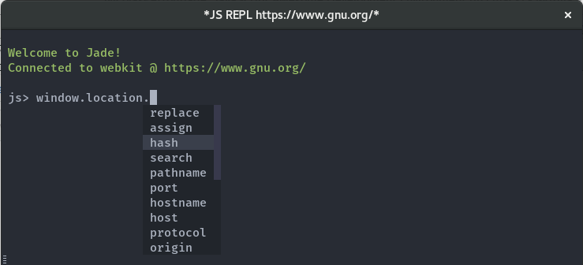

# Jade [](https://melpa.org/#/jade) [](https://travis-ci.org/NicolasPetton/jade)

_**J**avaScript **A**wesome **D**evelopment **E**nvironment (in Emacs)_


Jade connects to a browser tab or nodejs process and provides many features for
JavaScript development, including:

- a REPL (with auto completion) & object inspection;
- an inspector, with history and navigation;
- a scratch buffer (`M-x jade-scratch`);
- JavaScript evaluation in JS buffers with `jade-interaction-mode`;
- a stepping Debugger, similar to `edebug`, or `cider`.

## Screenshots

The REPL with company-mode



The REPL showing clickable output


The inspector


The stepping debugger, and an inspector on locals


## Getting started

(Emacs 25 is required)

It's available on melpa:

    M-x package-install jade

### Connection to a chrom[e|ium] tab

Chrom[e|ium] >= 54.0 is required for Jade to properly work (debugging protocol
v1.2).

Start chrom[e|ium] with the `--remote-debugging-port` flag:

    chromium --remote-debugging-port=9222 https://gnu.org
    
Evaluate `M-x jade-connect-to-chrome`.

### Connection to a nodejs process

Nodejs >= 7.0.0 is required for Jade to work. 

Start a node process with the `--inspect` flag:

    node --inspect myfile.js
    
If you wish to break on the first line of the application code, start node using:

    node --inspect --debug-brk myfile.js
    
Node will tell you to open an URL in Chrome:

    chrome-devtools://devtools/bundled/inspector.html?experiments=true&v8only=true&ws=127.0.0.1:PORT/PATH
    
Evaluate `M-x jade-connect-to-nodejs RET 127.0.0.1 RET PORT RET PATH`, `PORT`
and `PATH` are taken from the `ws` parameter of the above URL.

Connecting Jade to the node process will open a debugger on the first line of the application code.

### Debugging local files

Jade is able to use local files when debugging.  Once set up, breakpoints can
also be added/remove from local files.

How to enable it:

- NodeJS: Nothing to do, it just works
- Chrome (`file://` protocol): Nothing to do, it just works
- Chrome (`http://`/`https://` protocol): Place a `.jade` file in the root of
  the web directory where JavaScript files will be served to setup a workspace.

#### Setting up a workspace
  
When files are served using the `http://` protocol, Jade will try to find
local file by looking up a `.jade` file in the project.

##### Starting the connection when using a .jade file

When using a `.jade` file, make sure to start the connection using
`jade-connect-to-chrome` from the same directory (or a subdirectory).

##### Example configuration

With the following directory structure:

```
 project/ (current directory)
    www/
       index.html
       css/
          style.css
       js/
          app.js
       .jade
```

For the following URL "http://localhost:3000/js/app.js"
`jade-workspace-lookup-file` will return "./www/js/app.js".

#### Adding/removing breakpoints

- `C-c b b`: Toggle a breakpoint
- `C-u C-c b b`: Toggle a breakpoint with condition
- `C-c b K`: Remove all breakpoints from the current buffer

Note: Breakpoints are persistent: if the connection is closed, when a new
connection is made Jade will attempt to add back all breakpoints.

### JavaScript evaluation in JS buffers

Add the following to enable evaluation in all JS buffers:

    (add-hook 'js2-mode-hook #'jade-interaction-mode)
    
Then `C-x C-e` will evaluate the node before the point, and `C-c M-i` will
inspect the result.

The entire buffer can also be executed with `jade-eval-buffer`.

## Missing features

Jade is young, here's a list of missing/wanted features

- ~~Code evaluation using `C-x C-e` from project JS buffers~~
- ~~Adding breakpoints (to remove the need for `debugger` statements)~~
- Network inspector (could get inspiration from restclient.el)
- DOM inspector
- Start processes (~~chromium~~, node, grunt, gulp, etc.) from Emacs and attach a
  jade connection to it.

## Backends

There is currently support for Chrom[e|ium], & nodejs.  The firefox backend is
currently missing.


